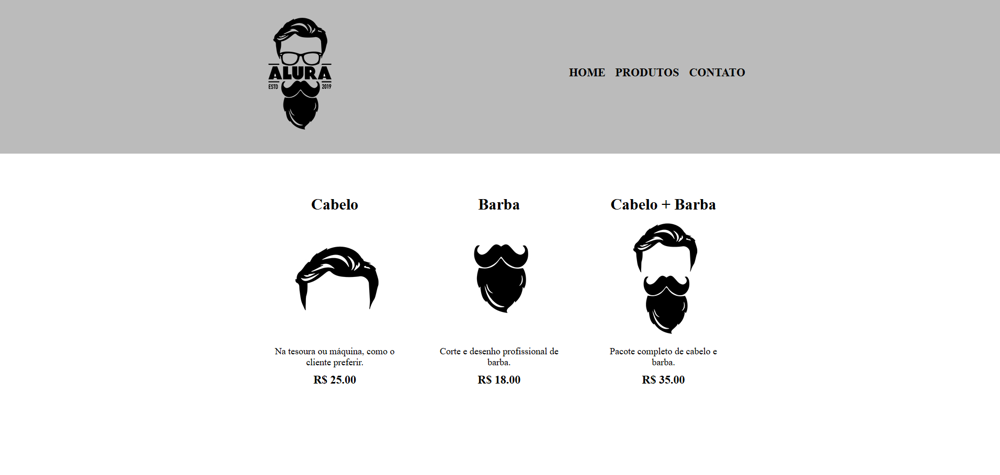

# 💈 Page Barbearia

Projeto de estudo desenvolvido para praticar **HTML e CSS**, recriando a interface de uma página de barbearia.

O objetivo do projeto é treinar conceitos fundamentais de **estruturação de páginas web, semântica HTML e estilização com CSS**.

---

## 📸 Preview



---

## 🚀 Tecnologias utilizadas

<div align="center">

  <div style="
    background-color:#0d1117;
    padding:16px;
    border-radius:8px;
    display:flex;
    gap:8px;
    flex-wrap:wrap;
  ">

  
  
  </div>
</div>

---

## 🎯 Objetivo do projeto

Este projeto está sendo desenvolvido com fins **educacionais**, com foco em:

- Estrutura semântica com HTML
- Organização de layout
- Estilização com CSS
- Posicionamento de elementos
- Trabalhar com imagens e background
- Construção de páginas estáticas

---

## 📂 Estrutura do projeto


Page-Barbearia
│
├── produtos.html
├── produtos.css
├── imagens do projeto
└── README.md


---

## ▶️ Como executar o projeto

1. Clone o repositório

```bash
git clone https://github.com/eduardonunesfvm/Page-Barbearia.git

Abra a pasta do projeto

Execute o arquivo:

index.html

no navegador.

📚 Aprendizados

Durante o desenvolvimento deste projeto foram praticados conceitos como:

Tags semânticas (header, nav, section, footer)

Organização de layout

CSS básico

Responsividade inicial

Boas práticas de estrutura HTML

📌 Status do projeto

✅ Em desenvolvimento (Projeto de estudo)

▶️Futuras Adições:

Sistema Backend
Banco de Dados